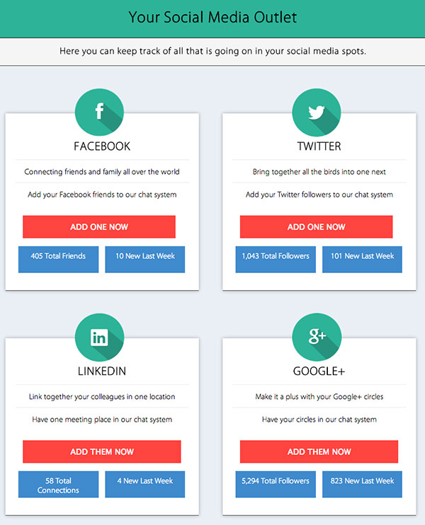

# Thinkful Session: CSS Positioning

### Session Outline

1. Variations of positioning
2. Setting up session project
3. Looking at the box model stacked 
4. Better understanding of positioning the box model
4. Using `position` property to adjust the location of boxes
5. Using `position` property to adjust the icons
6. Using `float`property to adjust the location of boxes
7. Performance consideration when using positioing: `position` vs `float`

---

### Part 2 - Absolute Positioning

This will be a one hour session that will go further in detail about positioning that was not covered in the front end web development course. Most students hit walls when trying to fully understand how positioning works. We hope to give each participant a better understanding that will remove any misunderstanding about the best use of CSS positioning.

### CSS Code Organization

1. Understanding `class` vs `id` so that the stylesheet does not get bloated and the HTML has more semantic meaning
2. How CSS can give you less markup to write
3. Properties structure

---

### How to Participate

Each step of the way in the session we will be switching branches that will allow us to focus on a certain aspect that we are covering in the session. It will be the code from that branch that you can alter during the session to see different outcomes from the talking points at that time.